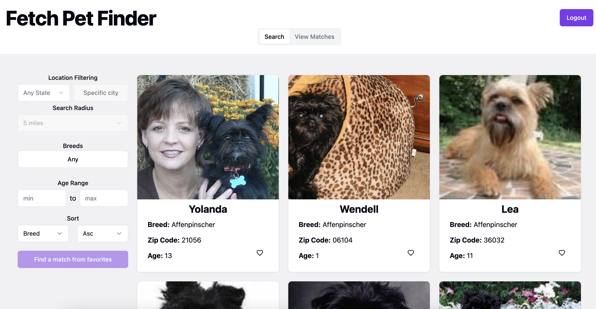

# Fetch Pet Finder App

Take home project for frontend developer position at Fetch! Thank you for taking time out of your busy day to review :)



Visit the deployed version: <https://fetch-fe-takehome.vercel.app>

## Running the App

To run this project you will need [`node`](https://nodejs.org/en). This project was developed specifically, with node version v22.10.0.
If you have [`nvm`](https://github.com/nvm-sh/nvm) installed, run:

```bash
nvm use
```

This will grab the correct node version from the `.nvmrc` file.

### Next

Install dependencies with `npm install`.

### Finally

To get the development server up, run `npm run dev`
and the server will be running likely on [`localhost:5173`](http://localhost:5173)

## Running Tests

To run unit tests and e2e tests sequentially, run:

```bash
npm run test
```

#### To run unit tests separately

[`Make sure you have dependencies installed`](#next), then run the command

```bash
npm run test:unit
```

#### To run e2e tests separately

[`Make sure you have dependencies installed`](#next), then run the command:

```bash
npm run test:e2e
```

You might get prompted to install some playwright browsers. If so, I believe the command to run is `npx playwright install`
